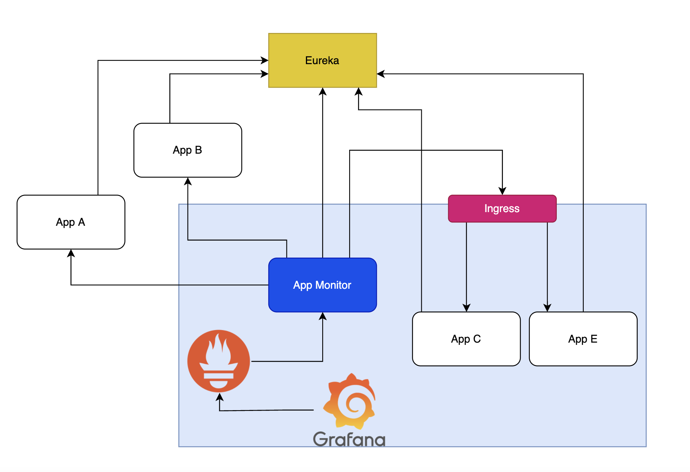

# Hackathon2022

We always want our site to be 100% uptime and hope it is us who first identified the issue if things go wrong, rather our clients.

Yes, we can use the spring actuator health endpoint. Unfortunately, in many cases, that one does not always give 100% confidence as zombie status happens, and we have to call some endpoints to make sure it is not only _up_ but also **functional**.

Similar to some up website uptime tools, we need an application monitor, that continues to call some critical endpoints, to ensure things are functional. Besides, we already have QA regression test cases, that do assert certain functionalities, which can be re-used.

The tentative idea is to wrap up some QA automation regression tests and make it to be a long live application that triggered at a scheduled time. In the meantime, it also tracked how long each endpoint response was, post them as micrometer metrics. Those metrics can be grabbed by Prometheus, show up in Grafana dashboard, and alert if reach a certain threshold.

---

#### Watch Dog
#### Application Monitor
#### Spring Hackathon, 2022

---
- Agenda
- Goal
- Approach 1
- Technology
- Architecture
- Approach 2
- Demo
- Lesson Leaned
- Next Step

## Goal
- Monitor Predict Experience (PX) micro-services
  - Actuator is not monitored and not enough
  - Lower environment (Stg / QA)
- Identify Issues earlier
  - Alert if response is long or timeout
  - Continues  check
- Save Cost

## Approach 1 – QA Regression
- Utilize the exiting Microservice QA regression tests
- Make a new application that call a subset of those tests
- Track the timing of running those tests
- Make graphic dashboard to view the status
- Alerting take a little long

## Technology Used
- Existing Microservice QA regression tests
- Springboot / Microservice
- Kubernetes
  - Prometheus
  - Grafana
  - Alert + Slack

## Architecture
- Approach - Actuator
- Get application list from Eureka
- Check if app is missing
- Check health end point for actuator
- Much simpler
- Very sensitive (false positive alert)

## Demo

## Lesson Learned
- K8s + Prometheus + Grafana + Alert works really well
- K8s port forwarding + immortal is not reliable
- Some regression tests caches OAuth token
- Tests need preparing / clean up data may not be good candidates
- Alert
  - Sensitive vs. False positive
- Pitfall
  - What happened for external network outage?

## Next Step
- Finish up the test cases
  - One or two for each app
- Fixing missing actuator /health check
- Formalize the deployment
- Setup the real alerts 
